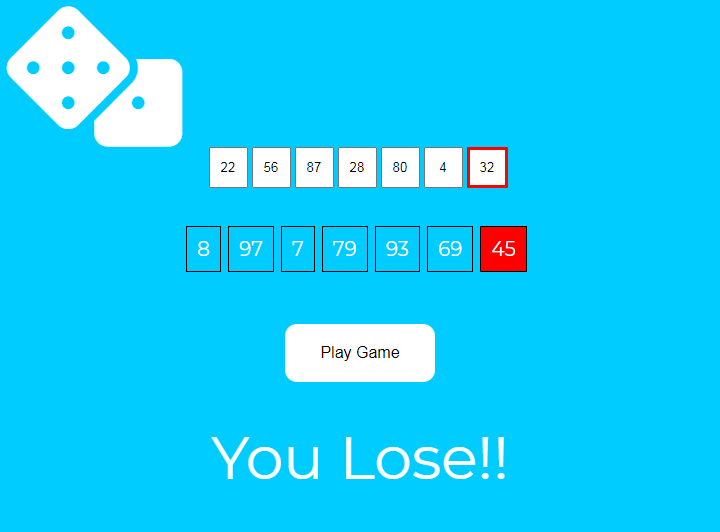

# powerBall

9/18/2020

Nicholas La Monaco

Lottery App Refactor

## User Story
Refactoring a lottery app to use loops instead of repetitive lines of code. 

Link to original:

https://medium.com/@ArtistJHooper/javascript-how-to-create-a-powerball-simulator-18fa0224ee14

## DEPLOYED SITE:

https://nlamonaco86.github.io/powerBall/

## FUTURE DEVELOPMENT

Compare any value in each array, rather than only identical indexes, to allow for more partial wins.

Total prize jackpot for this powerBall is currently $0.00.

 
